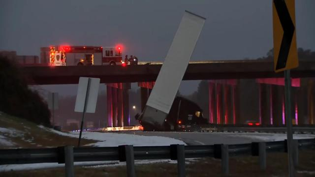
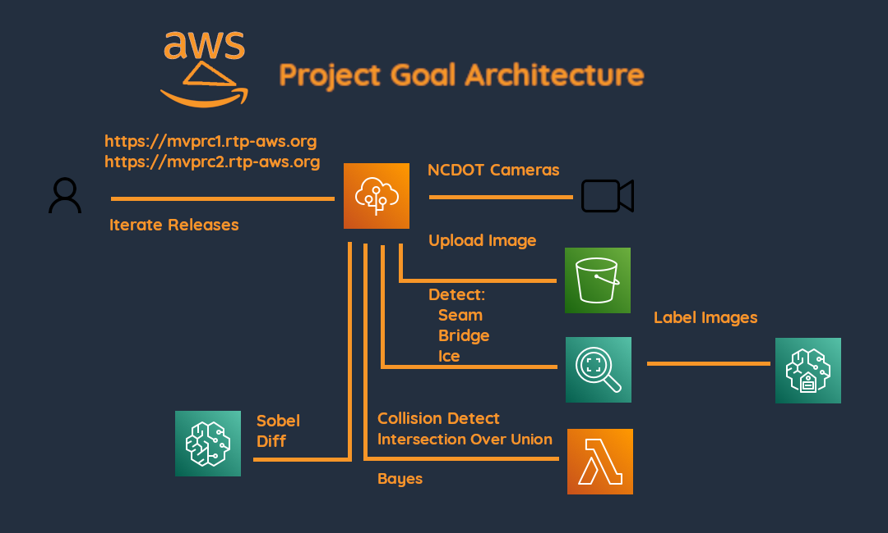
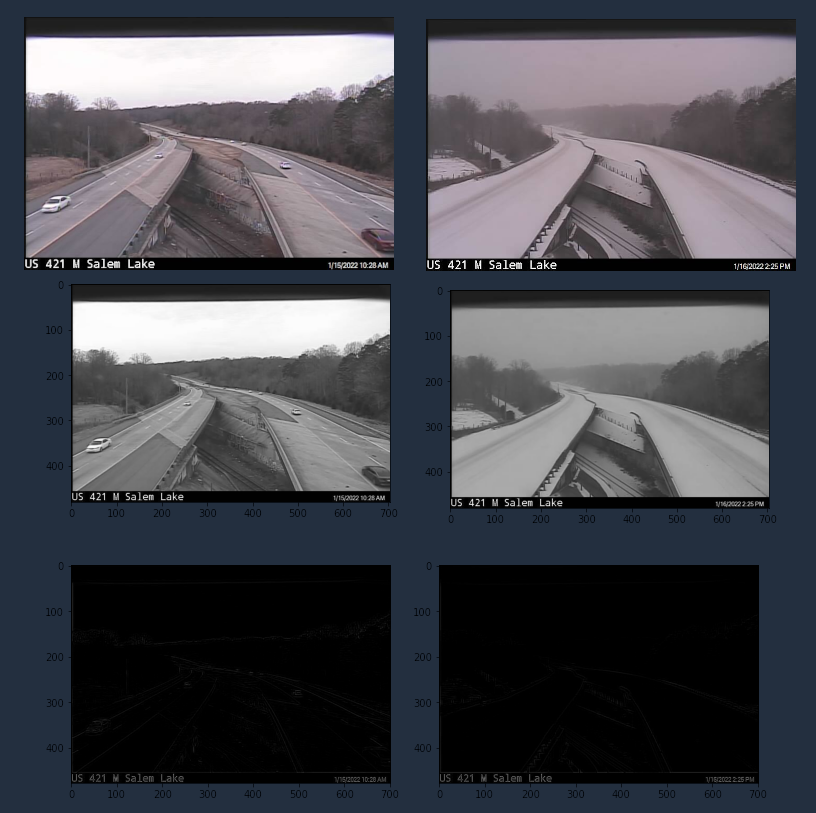

# devpost_aws_disaster_recovery

rtp-aws.org submission for devpost.com AWS Disaster Response Hackathon

While working on this project, [this](https://www.wral.com/tractor-trailer-slides-off-n-c-147-2-killed-in-nash-county-crash/20081601/) occured.

Later still [this](https://www.wral.com/ambulance-carrying-patient-skids-off-i-87-in-slew-of-ice-related-wrecks/20089162/) happened.

# Project Goal Architecture

# Devpost Entry

https://devpost.com/software/todo-ot17ds

# About the Repo

Each directory has a README.md.  Each directory has a Makefile.  Operations for the directory are makefile targets.

* `docs/`  Notes on how everything works are here.
* `bin/` Scripts are here Examples include webcam scrapes, crontab entries, sampling and S3 upload scripts.
* `imgs/`, `docs/imgs`  Images used by markdown files
* `raw_data/` Raw data gathered by the webscrape scripts. These are put in git so that everyone is working with the same data.  Please don't update this directory.
* `webapp/`  webapp releases written in HTML/CSS/Javascript via Express/Node.js server for AWS Elastic Beanstalk
* `python/`  .py files and jupyter notebooks.
* `matlab/`  Sample matlab experiments.
* `R/`  Sample R experiments.
* `secrets`  encrypted keys for AWS authentication.
* `video` Any videos are put here.  
* `icy-bridge` Curated images for labeling tasks and notes on weather conditions are here.
* `gt_rek` Notes on SageMaker Ground Truth datasets and Rekognition models are here.

# Project Requirments

This project is a Devpost AWS Disaster Response entry.  It has the following requirements:

1. Given a random North Carolina Department of Transportation (NCDOT) public web cam image, identify a bridge which is slippery due to ice.  This is in response to the hackathon entry requirement: `The solution must solve a challenge that is aligned with at least one of the phases of the disaster life cycle (mitigation, preparedness, response, recovery).`  In particular this requirement is a `mitigation solution.`  Furthermore, although not explicitly stated, it is understood that icy bridges is a natural example which fulfills the additional hackathonn entry requirement: `The solution must focus on a challenge that is present in one or more types of natural disaster (e.g. hurricanes/cyclones; wildfires; floods; earthquakes; drought; etc.)`
2. Given a random NCDOT archived image, identify a bridge which is slippery due to ice.  Since this is a real world solution, and icy bridges are not always present, work with archived images is key.
3. Provide a webapp for general use that demonstrates requirements.  Although not stated in intial requirements, the hackathon does specify a `Try it out links` section for `Add links where people can try your project or see your code`.  This github is where people can see the code.  The webapp is where people can try it out.
4. Implement some portion of the project using machine learning via SageMaker to fullfill the devpost entry requirement `Build a machine learning project with Amazon SageMaker Studio Lab that improves disaster response.`  (The Devpost requirement mentions that the model does not need to be implemented from scratch.  Building a model which deploys an AWS Rekognition is sufficient)

# Project Development Approach

First thing we are going to do is simple.  See if we can use edge detection to model a simple approach.  Do a edge detection operation and see if we can detect a change.

Here is a subset of the NC 147 (Toll) & Davis Drive camera.  The image shows the seam between the elevated portion which will freeze first and the part which is not elevated.  Wind will not be blowing underneath this part.  Also traffic is not likely to be there, so we might find it helpful.  The interesting part is that we are lucky that its concrete on both portions where the edge is.  I'll drive out to take a look.  Perhaps the non elevated portion is where the asphalt starts.  However, note the other end of the bridge looks like the concrete extends to the non elevated portion.

and the edge version

Sadly the NC147 camera moved and never showed the same camera angle on the day of the ice storms.  With that said, here is a comparison of two images of a similar bridge.

Consider this process instead

You can see the bridge seam is different and given image processing you could determine the change.

## Development Method

Ideally this work will be split among multiple people.  However as I write this in hindsight its basically just me.  With that said, the method is to iteratively develop a solution as quickly as possible.  

With the idea that given some base requirements build a release as quickly as possible which meets some portion of the requirements and iterate the releases while improving upon requirements.

## Project History

### Initial Start

I learned of the devpost contest on 2022 01 10.  That day the repo was created and the devpost entry started.

I immediately started recruiting team members.  I also started the process to Identify and Locate NCDOT Cameras.  I contacted numerous government officials and employees to assist with the effort.  I contacted local TV stations which host traffic cameras and even talked to a few city, county, state and federal employees.  I got few if any responses.  Eventually one lead from a retired county employee said I should contact the local TV station weather reporter directly.  I mentioned that I had already contacted one TV station and did not receive a reply.  However, I noticed that the webcam hosted on their station matched the webcam on the TV station website I had already contacted.

I examined the URL and eventually found this [site.](https://drivenc.gov/#adverse-weather)  

### Gathering of Project Resources

On 2022 01 11 I started gathering materials to use for development.

* Previous matlab scripts used for image processing was added.  A 1D convolution sample was provided and implmented.
* Previous R scripts for Statistical based prototyping was added.
* Previous Python scripts from a class I took previously on AWS Computer Vision with Gluoncv and MxNet were added.  A demo for doing Sobel Diffs with images via a Juypter notebook was added. 

The Sobel Diff test does not demonstrate ML on Sage Maker per se, but it does meet the requirement for using Sage Maker.  It was tested on Sage Maker but mostly done via a local computer for simplicity.  ie. the intial work was done on Sage Maker but the notebook was exported to run in a pyenv virtual environment locally.

### Web scraping

The first implementation of the bash script and crontab entry for webscraping the NCDOT cameras was added on 2022 01 13.  It was determined that the cameras had various problems

* Not all cameras have the same update period.  I settled on a 5 minute interval and for those cameras which had a slower update period, I implemented a bash script to remove duplicate images. ie. a camera which updates on a 10 minute interval will have two duplicate images before it is updated.  Rather than have different timing of web scrapes, just continue with one update period and afterwards prune duplicate images.
This approach was taken so that I could simply add multiple cameras without having to
determine the update period of each camera.

## Minimal Viable Release Candidate 1 (MVPRC1)

When it became apparent I was not going to be able to find someone to do the front end work, I started this effort myself.  The front end work is more important than the actual image processing/ML work since it provides an aide to project recruitment.  Thus as a higher priority task it became the focus of development.  However it is also my weakest skill so it took me a considerably long time to learn how to host and implement a webapp using AWS.

The first commit was 2022 01 17

This [webapp](http://mvprc1.rtp-aws.org/) hosted on AWS Elastic Beanstalk demonstrates how to:

* host a webapp using AWS Elastic Beanstalk
* view NCDOT cameras
* use authenticate AWS Cognitio 
* use AWS Rekognition to perform predictions using a webcam 
* obtain a blob from a CORS restricted NCDOT camera image

During upload of blob as image files to AWS S3 buckets it was exposed failures in 
the implementation of Javascript and Node.js.

Also during this time some intial stabs at learning AWS Rekognition and Sage Maker Ground Truth were started.

## Minimal Viable Release Candidate 2 (MVPRC2)

This [webapp](http://mvprc2.rtp-aws.org/) hosted on AWS Elastic Beanstalk demonstrates how to:

* perform prediction with AWS Rekognition using default labels

It was the second webapp frontend.  It was a redesign of the first approach with AWS Javascript API v2.  It separated the Javascript browser code from the Node.js Express
setup properly and simplified development.  Default label detection works in this model but as I learned later, bounding boxes were provided for Bridges.  I always expected a Bridge seam and ice would need to be done with a custom model so this was not unexpected.  I simply wanted to test bounding box drawing with the default model.

The first commit was 2022 02 03

## Sage Maker Ground Truth and AWS Rekognition

Once it was learned that bounding boxes are not available for all Labels returned with the default AWS Rekognition DetectLabels API, I revisited AWS Sage Maker Ground Truth to label images.  The first time I did this as a custom Label task.  This time I did it as a object detection task.  

This Model was named C3 (2022 02 04) and the approach was as follows:

Choose images from the two ice storms given images before and during the ice storms.   Use images which showed a bridge and roadways.  Since the bridges change view points
provide images of both.  Label 

* bridges
* ice
* bridge seams

The goal was for a given image, identify a bridge, identify ice.  If ice is in the same vicinity of the bridge then its a level one warning.  The identification of the bridge seam was secondary and just to see if it could be located.  I intended to use Intersection over union to determine the amount of overlap between the two bounding boxes.  I started the process of building an AWS Lambda and AWS API Gateway via Rest to implement the IOU algorithm during model training.

However when the model completed training and evaluation, I discovered it was a miserable failure.  

Not a problem.  I also learned that I had to many object labels identified.  I will attempt a simpler goal of just building a model with the goal of identifying the bridge seam.

## NCDOT Cameras

This [site](https://drivenc.gov/#adverse-weather)  has cameras.  

I've managed to establish communications with [ncdot](https://www.ncdot.gov/travel-maps/traffic-travel/severe-weather/Pages/winter.aspx).  As a result, I have learned they don't maintain camera footage.  So, I can't ask for them to provide a stable, hi-res, continuous feed of past events in conjunction with a camera using the same viewpoint.  It is what it is.  Hence, I am using what is publicly available and web scraping and archiving.

### Issue with these cameras

* The cameras vary in quality
* The cameras are not fixed. Sometimes they point at a road.  Sometimes a bridge.
* Furthermore, the angle is not fixed.  When pointing at a bridge, a seam between elevated portion and non elevated is never the same.

These are some of the URLs obtained by chrome developers tools.  These images will update.  Currently not all of the ones pulled are listed here. See [here](imgs/raw_data) for the current dataset.

These were obtained by watching the urls via chrome developer tools.  I made a video in hopes of having additional folks provide find good footage [here.](https://youtu.be/RRuaG0_W7B4) 

### Sample cameras.

The cameras used for the project are reflected in the web app.  These are the intial cameras found with some commentary for historical reference.

#### NC 147 (Toll) & Davis Drive

#### I-440 & US 64 Bypass

#### I-540 & US 401

#### Toll 540/US 1

#### Toll 540 & NC 54

#### I-40 @ US-1

#### TOLL540 and Apex BBQ Rd

# Quickstart for contributors

I'm getting messages about how to help.  What to do?  I'm sorry I am not more
available.  Perhaps this note will give you an idea of my approach to this project.

1. Make a github id.  Afterwards ask for access to the repo, or send it via slack.
2. Visit https://rtp-aws.org look at the *about* page and join the slack workspace and then join the `#hackathon` channel.  Try to keep your conversation there. I'm not big on thread stuff, so don't worry about that.
3. Do whatever you wish.   Do whatever you think moves the ball forward based upon your own idea.  To update the github repo, you will need to do a `git pull request`.  I'll address the commit.  You will learn how to "do it by doing it." The slack is available to ask questions. FWIW, we spent two weekends doing `git pull requests` a few weeks ago in our usergroups.  I documented [git usage](https://gitlab.com/netskink/git-testy)  a while back.  If that repo doesn't help you,  do as I do  `google site:stackoverflow.com how do I yadda yadda`. Or, ask me. Most likey we will start together with the previous step though.
4. If you do whatever you wish is too general,  examine the code. Look for the keyword `TODO:`  This is your signal something has been left to-do.  You can do it.  I believe in you.
5. Larger to-do tasks are identified in the github issues tab.  You can either file
a bug or a feature request.  I'll let you know my opinion via the issue.  Don't be intimidated.  Its an easy way to work out issues.
6. Attend the weekly workshop Sundays at 11:00am EST. The online meeting is on https://rtp-aws.org in the about page.  If you are so inclined join the earlier 10:00am EST meeting for gcp.

General opinion on my approach.  I am not a good leader/motivator whatever. I am not
even a good teacher.  I am simply a guide.  This is what I want you to
keep in mind.  I'm pointing the way just a little bit.  I'll use the github issues to
identify the issues as I see them.  You can adjust the direction by adding new issues
or updating existing issues.  Its that simple.
