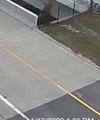

# devpost_aws_disaster_recovery
rtp-aws.org submission for devpost.com AWS Disaster Response Hackathon

# debpost entry
https://devpost.com/software/todo-ot17ds


# About the repo

File are mostly kept in directories.  Each directory should have a README.md
Maintain notes about the directory there.

* `bin/` scripts and crontab for webscrape
* `imgs/`  images used by markdown files
* `raw_data/` raw pull of data by the webscrape script. These are put in git so that everyone is working with the same data.  Please don't update this directory
* `matlab/`  sample matlab experiments
* `R/`  sample R experiments

# Quickstart for contributors

I'm getting messages about how to help.  What to do?  I'm sorry I am not more
available.  Perhaps this note will give you an idea of my approach to this project.

1. Make a github id.  Afterwards ask for access to the repo, or send it via slack.
2. Visit https://rtp-aws.org look at the *about* page and join the slack workspace and then join the `#hackathon` channel.  Try to keep your conversation there. I'm not big on thread stuff, so don't worry about that.
3. Do whatever you wish.   Do whatever you think moves the ball forward based upon your own idea.  To update the github repo, you will need to do a `git pull request`.  I'll address the commit.  You will learn how to "do it by doing it." The slack is available to ask questions. FWIW, we spent two weekends doing `git pull requests` a few weeks ago in our usergroups.  I documented [git usage](https://gitlab.com/netskink/git-testy)  a while back.  If that repo doesn't help you,  do as I do  `google site:stackoverflow.com how do I yadda yadda`. Or, ask me. Most likey we will start together with the previous step though.
4. If you do whatever you wish is too general,  examine the code. Look for the keyword `TODO:`  This is your signal something has been left to-do.  You can do it.  I believe in you.
5. Larger to-do tasks are identified in the github issues tab.  You can either file
a bug or a feature request.  I'll let you know my opinion via the issue.  Don't be intimidated.  Its an easy way to work out issues.
6. Attend the weekly workshop Sundays at 11:00am EST. The online meeting is on https://rtp-aws.org in the about page.  If you are so inclined join the earlier 10:00am EST meeting for gcp.


General opinion on my approach.  I am not a good leader/motivator whatever. I am not
even a good teacher.  I am simply a guide.  This is what I want you to
keep in mind.  I'm pointing the way just a little bit.  I'll use the github issues to
identify the issues as I see them.  You can adjust the direction by adding new issues
or updating existing issues.  Its that simple.

# What are we trying to do

First thing we are going to do is simple.  See if we can use edge detection to model a simple approach.  Do a edge detection operation and see if we can detect a change.

Here is a subset of the NC 147 (Toll) & Davis Drive camera.  The image shows the seam between the elevated portion which will freeze first and the part which is not elevated.  Wind will not be blowing underneath this part.  Also traffic is not likely to be there, so we might find it helpful.  The interesting part is that we are lucky that its concrete on both portions where the edge is.  I'll drive out to take a look.  Perhaps the non elevated portion is where the asphalt starts.  However, note the other end of the bridge looks like the concrete extends to the non elevated portion.



and the edge version


## NCDOT Cameras

This [site](https://drivenc.gov/#adverse-weather)  has potential cameras.  However they are tiny low res images and not live.  I have contacted the NCDOT but not received a response.

These are active webcams which provide a jpg.  

The urls look like its a camera name and timestamp.  Its not a timestamp. Fetch of that URL gives the current camera image.  


### Best Camera so far

#### NC 147 (Toll) & Davis Drive
In the lower right corner is the closest view of boundry of roadway and elevated roadway.  However, the corresponding median portion is not visible.  Such a pity, they could have angled the camera down a few degress and it would be perfect.


```
https://tims.ncdot.gov/TIMS/cameras/viewimage.ashx?id=Toll147_DavisDr.JPG&t=1642082764209
```


### Other Potential cameras


#### I-440 & US 64 Bypass
This one has a good view of white line, shoulder and appears to be potentially high res.  Its also not obscurred with text overlay.


```
https://tims.ncdot.gov/TIMS/cameras/viewimage.ashx?id=I440_I87.JPG&t=1642081402751
```

#### I-540 & US 401 
This one could be hi-res.  It shows the seam between road and elevated roadway.


```
https://tims.ncdot.gov/TIMS/cameras/viewimage.ashx?id=I540_US401.JPG&t=1642082230568
```
#### Toll 540/US 1
Newer camera.  Shows junction of roadway and elevated roadway, but distant.


```
https://tims.ncdot.gov/TIMS/cameras/viewimage.ashx?id=I40_US1-64.jpg&t=1642094997214
```


### Not good ones, but notable

#### Toll 540 & NC 54

What are is this, Russia?  Does show the median.  Low res and does not show seam.


```
https://tims.ncdot.gov/TIMS/cameras/viewimage.ashx?id=Toll540_NC54.JPG&t=1642082877653
```

#### I-40 @ US-1

Shows roadway with wide median and seam in distance. Also seems to be well lit.  Is than error?


```
https://tims.ncdot.gov/TIMS/cameras/viewimage.ashx?id=I40_US1-64.jpg&t=1642083392226
```
#### TOLL540 and Apex BBQ Rd


Shows roadway with wide shoulder and hi res.  If the camera was angled down some it could be awesome.


```
https://tims.ncdot.gov/TIMS/cameras/viewimage.ashx?id=Toll540_Apex-BBQ.JPG&t=1642095317555
```
