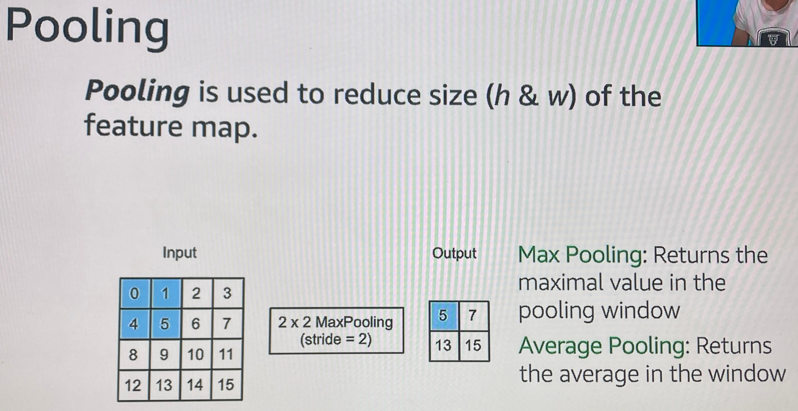
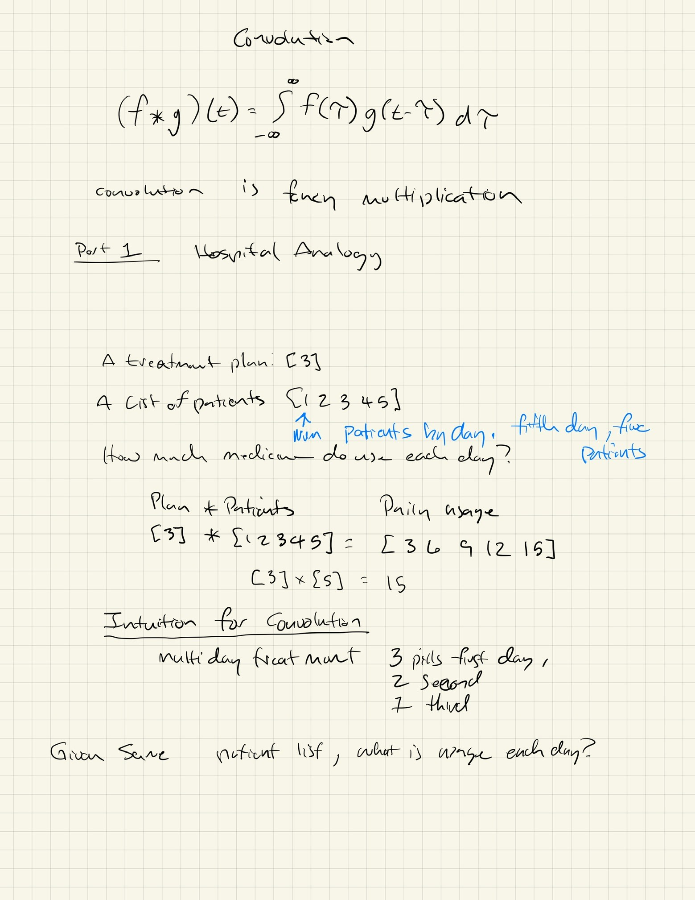
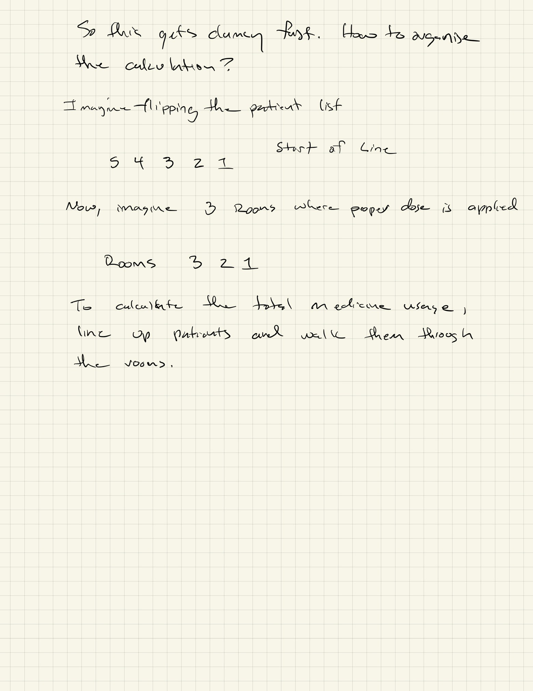
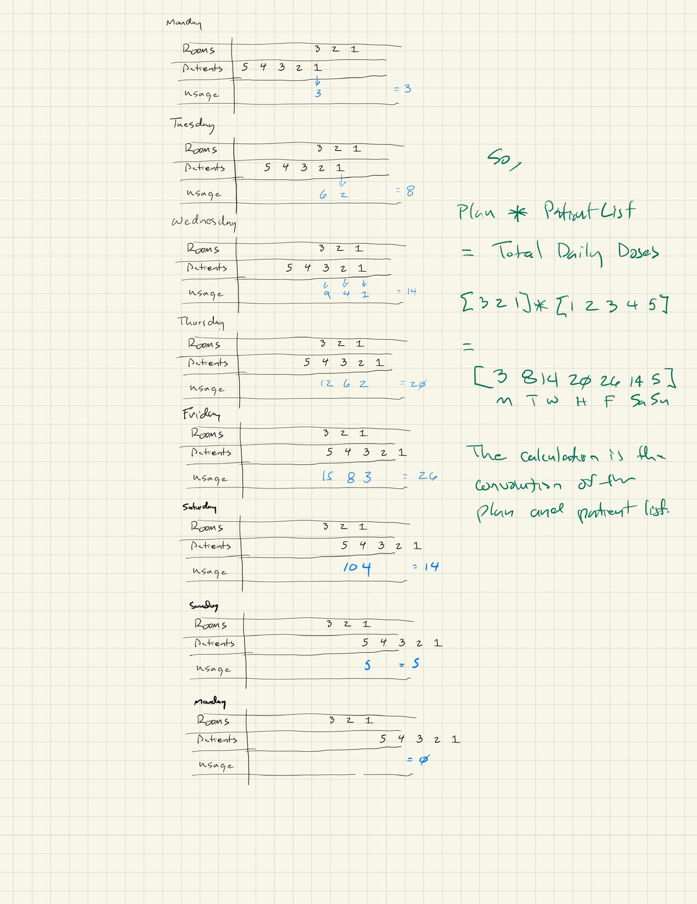
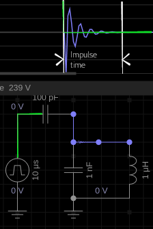

# Image Processing, Convolution and CNN

We are using CNNs to do CV ML.  These are notes regarding general purpose image processing, convolution, the C in CNN and Convolution itself.

# CNN Models

A model is built of layers.  Here is the diagram from the [AWS Computer Vision Playlist](https://www.youtube.com/playlist?list=PL8P_Z6C4GcuU4knhhCouJujFZ2tTqU-Ta) given in the [SageMaker Studio Lab](https://studiolab.sagemaker.aws/) instance when you first login.

The input to the model is a 2D or 3D image. For simplicity it is often a 2D grayscale image.  Color images have a RGB component.  A RGB (Red Green Blue) image is a 2D array scaled in three dimension for each of the three color components RGB.  Images can also have an opacity 
dimension as a fourth layer.

The images components can vary 0-1 as floating point or 0-255 as integers.

Here is how you load an image for use with general purpose image processing or input to the CNN.  I'll do examples in Matlab/Octave and Python.  Sometimes the tools are helpful to compare between the different frameworks.  

'''
for now see the convolution.ipynb
'''

They are saying the dense layers are fully connected neural nets. Like what you see 
[here](https://playground.tensorflow.org/#activation=tanh&batchSize=10&dataset=circle&regDataset=reg-plane&learningRate=0.03&regularizationRate=0&noise=0&networkShape=4,2&seed=0.88700&showTestData=false&discretize=false&percTrainData=50&x=true&y=true&xTimesY=false&xSquared=false&ySquared=false&cosX=false&sinX=false&cosY=false&sinY=false&collectStats=false&problem=classification&initZero=false&hideText=false)

The Conv layers are DSP like operations which perform 2D convolution.  

The pooling layers *often* follow after a convolution layer.  This is so that values 
in the array are summarized or (image gets smaller reducing complexity)

# Convolutions layers

Convolution layers are 2D convolution operations

Presenting the slides in order for later discussion

This looks like a stride of 1 with no padding.  Verify

## Filters

Filtering is just convolution with a different type of second matrix.  More about this later when I simplify it to 1D convolution.

## Stride

Stride determines if you do every pixel or skip some. You can have different stride in x than y.

## Padding

Padding is how you treat edge pixels which do not have a full set of adjacent pixels.

# Pooling layers

Some of this is coming from memory.  Some from this
This blog post does differently than I do in the convultion.ipy notebook.  

>He is using keras pre tensorflow [here](https://machinelearningmastery.com/pooling-layers-for-convolutional-neural-networks/)?

* minpoollayers take min of a operation
* maxPoolLayers take max ...
* avgPoolLayers take avg ...

The stride determines if the convolution makes a larger or smaller matrix output.
I need to test this.  I thought it was always larger.

If no padding, the next [guy](https://towardsdatascience.com/a-beginners-guide-to-convolutional-neural-networks-cnns-14649dbddce8) says:

* stide == 1 image stays the same
* stride > 1 image gets smaller.  Makes sense, you are omitting, but still need to test.
  
   

Only thing to do is test it.

# 1D Convolution

The [betterexplained](https://betterexplained.com/articles/intuitive-convolution/) website does a good intro of this.  

Here are my notes for now via image.

For determining the sliding portion size, consider a filter response to an impulse input.
You see this in undergraduate linear systems.  This figure shows a simulated impulse input.  The circuit explorer linked below is not mine.  I simply pulled one and used it as a start.  Here is the explanation of how to consider this.

The signal is applied has infinite height and zero width.  The response is the decaying output.  A tank circuit will oscillate when gain=1.  This circuit has gain<1.  The response is then reversed and applied at time of interest.

The green line is the impulse.  The blue line is the impulse response.

> if you cant to play with the circuit its [here](https://everycircuit.com/circuit/6553516191252480)

Now, in this image from the book *Digital Signal Processing Primer* by Ken Steiglitz it shows an intuititave way to view the length of the filter sample array.  For a given time, that is put reversed at that time.  The back samples go until the response is zero.  

In this figure, the wide spaced dots correspond to the blue graph above.  The signal of interest is the closely spaced black dots.  Its not the green.  Its a signal like a audio sample.  Note, the time/sample number is at t=150.  In our example, this would be day=150.  The dosage_schedule would only go back to t=147 and then it would be zero thereafter.

