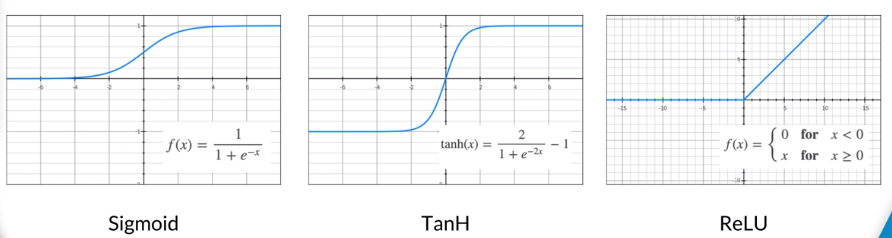

# Deep Learning and Deep Neural Networks

## Activation Functions

Activation functions are simply mapping functions.  They map node outputs
to a space non linearly.  This is important for two reasons.

* If the DNN was all linear operations, all the layers could be collapased
into a single layer due to linearlity.  Adding a non linear output 
prevents that.  The additional complexity of having multiple layers
enables the network to find additional features.

* The mapping function aspect enables a continous range of input to be
mapped to a narrower range.

## Sigmoid

Maps output between 0 and 1

The first choice historically.  

f(x) = 1 / ( 1 + e^-x )

Drawbacks

* complex to compute
* output is not centered around 0

## TanH

Maps output between -1 and 1

Similar to Sigmoid but zero centered.

f(x) = 2 / ( 1 + e^-2x ) - 1

## ReLU

Maps output between 0 and inf

This a popular choice since its computationally easy to implement.

f(x) = 0 for x < 0  and 1 for x >= 0

