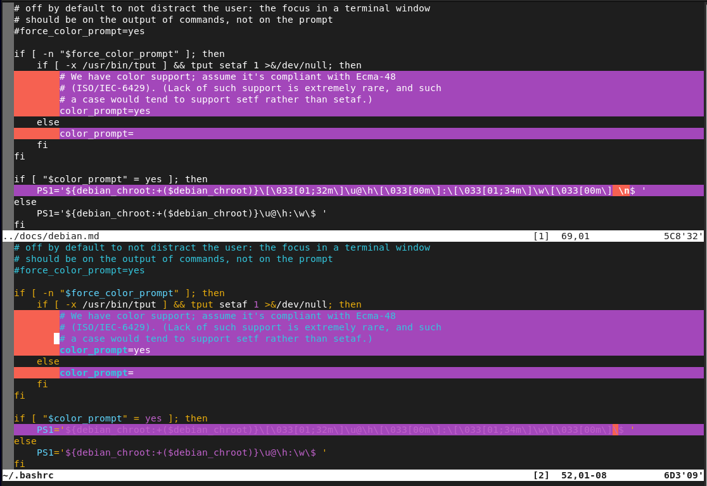

# vim notes

# diff buffers

While working on this code I remembered once again I had a problem with
my prompt on the newly installed computer.  Basically I reinstalled 
the computer since I had custom partitions which were sized miserably 
wrong.

I had copied a portion of my bashrc to the debian.md file on this computer.
That way, I could compare the file to the bashrc here.

With that said, I split the window and used the `:windo diffthis` method
to compare the two buffers.  

Here it is in action.

As I write this, I notice my .vimrc is not set as well.  A task for another day.

#### diff buffers TLDR

1. open two files with vim. `:edit foo.one` `:edit foo.two`
2. split the window. `:split`
3. switch to diff mode.  `:windo diffthis`
4. switch back. `:windo diffoff`

