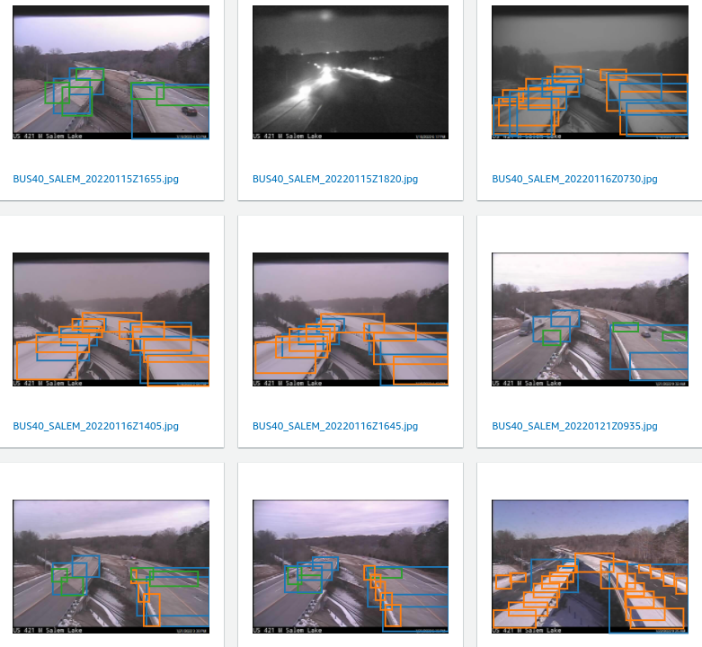
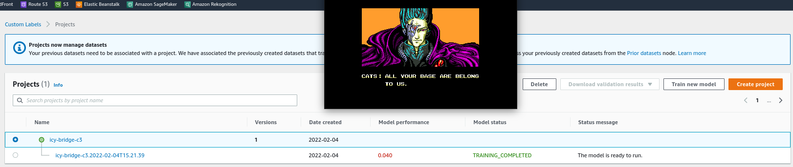

# Notes regarding SageMaker Ground Truth and Rekognition

## SageMaker Ground Truth

Ground Truth is the labeling workflow.  You provide image datasets in an S3 bucket and given a team of developers it provides a login portal for the team to label the images.  The result can be imported into Rekognition to build a model.

I've created  a few labeling jobs, teams, done some labeling etc.  These
are the notes taken during the label task of C3 for bounding boxes.

### Things to note about labeling

If camera angle is such that bounding box can be perpendicular to seam, it would
be excellent.  Its one bounding box instead of multiple.  Here is an example.

# Datasets and Models

## C3

Used multiple camera locations.  The Labeling and model performance was dismal.  A couple of things to learn from this mistake.

* The goal of a general purpose object identification of non aligned objects is difficult.  In other words locating and identifying the ice with a series of overlapping bounding boxes was probably not a good choice.
* Using multiple images of different viewpoints was also probably not a good choice for a first test.
* Having an image with too many labels is also problematic.  Ground Truth let me label the image with many bounding boxes, but later in Rekognition there was a limit.  The screenshot shows the labeling after the problematic images were reduced in label count.

The results were absysmal.  The dotted white lines were identified as ice for example.

## C4

Focus on a single bridge.  The goal is to identify the bridge seam.  As another test I also labeled the bridge seam to see if it could be regularly identified.  A simple predictor would be given an image can the model predict where the seam is located?  If the seam can not be located its a pretty good chance that 

As an additional reference I selected auto labeling option in ground truth.  I don't see any difference though.

For reference this is how I setup the C4 model from sagemaker ground truth.

