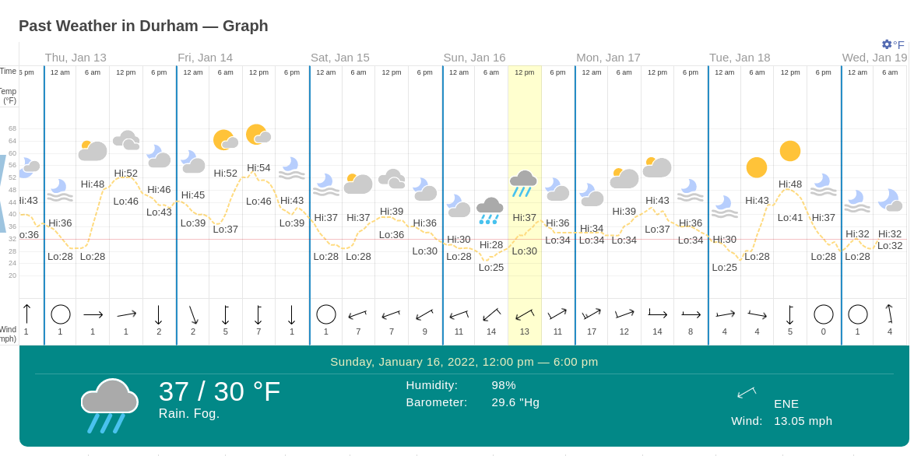
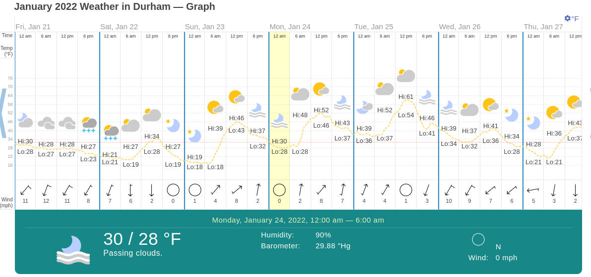
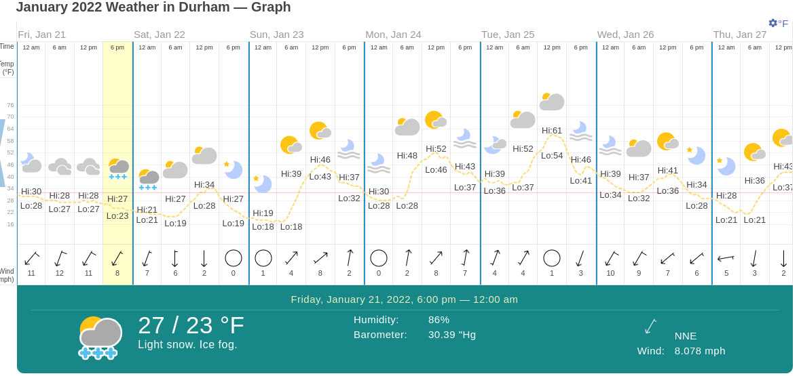

# Notes on Curated Cameras Images

These are the cameras chosen for the experiment.  These are the notes
on which cameras have the best views of the bridge before and after the ice
storm.

| Camera Name           |  Size   |  Resolution | 0115   | 0116 | 0121   | 0122   |
| :---------------------|    ----:|  :-------:  | -----: | ---: | ---:   | -----: |
| `BUS40_SALEM`         |   40KB  |  704x480    | Both   | Both |  Both  |   Both |
| `I540_US401`          |   50KB  |  640x360    | Both   | Both |  Both  |   Both |
| `TOLL54_APEXBBQ`      |  230KB  | 1920x1080   | Road   | Road |  Road  |   Road | 
| `TOLL147_DAVIS_DR`    |   30KB  |  720x576    | Bridge | Road | Bridge | Bridge |
| `TOLL147_HOPSON_RD`   |  240KB  | 1920x1080   | Road   | Road |  Both  |   Road |
| `TOLL540_DAVIS_DR`    |   50KB  |  720x480    |        |      |  Both  |   Both |

# Weather Report week of 20220113-20220119

These are the weather conditions of the week for the first ice storm

# Weather Report week of 20220121-20220127

These are the weather conditions of the week for the second ice storm

# Notes about how images were picked

I have nearly 40K images.  Some were chosen based upon consistent views,
large image size or shots of bridge seam.  I put these in a bucket based
upon camera name and date.

* picked first photo taken each day Dawn
* picked last photo taken each day Dusk
* picked approximately 8 photos at interval throughout day
* occasionally picked a good photo of well lit shot or a good shot of a seam

Some photos are dark, some have sun glare/lens flare, some have moisture or ice on lens.

Some cameras were not selected initially so the photos are missing for that date.

# Directory Notes

* imgs is for this document
* m10_xxxxx is approximately 10 images pulled from raw data for a specified camera and date.
* c3 is a random pic of 3 images from each of the above buckets.
* call is all images from each of the above buckets.
