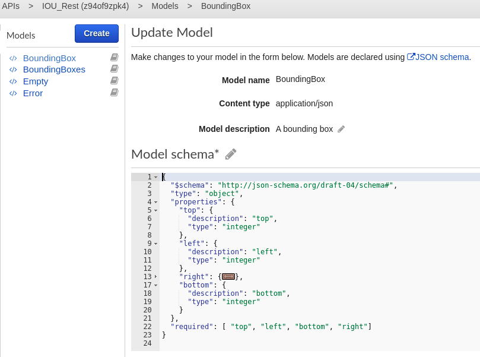
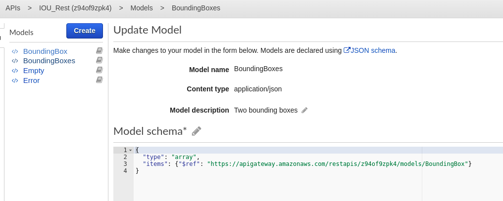
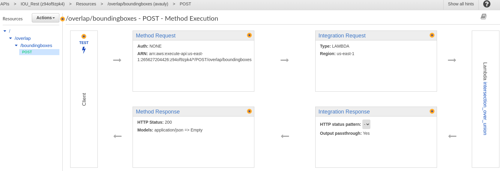
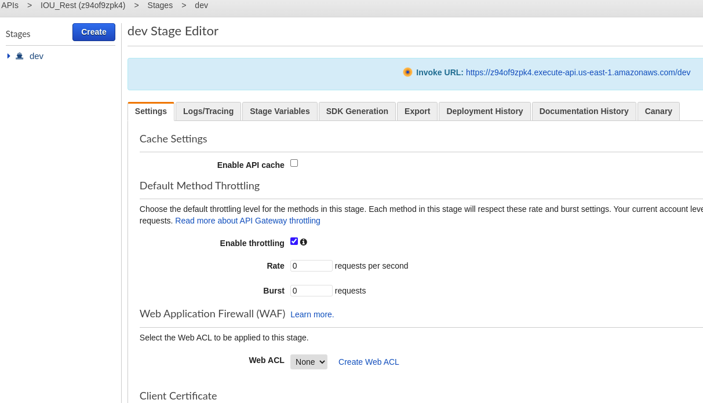

# API Gateway and Lambda functions


This is a jumbled mess, but its raw notes and not revisited.  I'm still adding to them.

The first shots here are of API gateway showing the model->resource->method setup.  The
details of how to manipulate the connection(integration?) to mock or lambda are in the
text below.  The syntax of the mock integration syntax for returning variable results
is lookie lookie at the moment.  I'll update and elaborate that bit as I learn it.

I'm not worried about the api key at the moment since its throttled to zero usage.  I'll update
that as I revisit this section.  In reality I plan to use HTTP API style config rather
than REST API style since it is cheaper. I just haven't figure it out yet.  I've only
done some initial stabs without reading at this point.

## Model screenshots

The base bounding box



The connection to a pair.  I don't need to identify each box since I test a pair.




The POST method



The stage where I set the throttle to zero.  If the cost goes up unexpectantly I set the
throttle to zero via the killswitch lambda.




# Here down is a mess.  Yikes!

Rather than trying to implement `Intersection over union`, in Javascript, lets try to make a python lambda function.

## Intersection over union

IOU is where you calculate the percentage overlap of two bounding boxes.  I intend to use this as a first pass to see if there is ice in the vicinity of the seam or bridge.

### URLs

https://stackoverflow.com/questions/25349178/calculating-percentage-of-bounding-box-overlap-for-image-detector-evaluation

https://gamedev.stackexchange.com/questions/586/what-is-the-fastest-way-to-work-out-2d-bounding-box-intersection

https://towardsdatascience.com/intersection-over-union-iou-calculation-for-evaluating-an-image-segmentation-model-8b22e2e84686

## The lambda function proper

Created by choosing the blueprint hello-world-python.

When created it said this:

>Lambda will create an execution role named intersection_over_union-role-906j30uj, 
with permission to upload logs to Amazon CloudWatch Logs.

- [ ] Add destination
- [x] Add trigger for API Gateway

API Type was left at default of `HTTP API`.  The first time I did `REST API`.  According to docs, `HTTP API` is the new thing.  

For security I left it as open.  It has an option for JWT, but I'll revisit after
the hackathon deadline.

Additional API Gateway settings as so:

- [x] Cross-origin resource sharing (CORS)
      
      CORS is required to call your API from a webpage that isn’t hosted on the same domain. This option enables cross-origin resource sharing (CORS) from any domain by adding the Access-Control-Allow-Origin header to all responses.

- [ ] Enable detailed metrics

Lambda will add the necessary permissions for Amazon API Gateway to invoke your Lambda function from this trigger. [Learn more](https://docs.aws.amazon.com/lambda/latest/dg/intro-permission-model.html) about the Lambda permissions model.


### URLs

#### Using an api key

This only applies to the first attempt which was a lambda function of the REST API type.

https://stackoverflow.com/questions/39061041/using-an-api-key-in-amazon-api-gateway


#### Adding numpy to a lambda function

This requires adding a layer and selecting AWS Layer, AWSLambda-Python37-SciPy1x


# REST and the api key

I'm not worried about this api key being leaked since the lambda function is deleted.
I'm still going to get a warning from github I imagine.

The rest api endpoint:

````
 https://sl9yff7gd9.execute-api.us-east-2.amazonaws.com/default/intersection_over_union
 ```

The api key and form:

```
x-api-key=vjV0eLJT9MLvX8pUAgnT42ZTggO4hI8AvWGqTPh0
```

The sample input data:

```
{
  "at": 1,
  "al": 1,
  "ab": 3,
  "ar": 3,
  "bt": 2,
  "bl": 2,
  "bb": 4,
  "br": 4
}
```

The generic  form for a curl:

```
$ curl -X POST -H "x-api-key:theKey" -H "Content-Type:application/json" -d '{"key":"val"}' https://[api-id].execute-api.[region].amazonaws.com
```

The specific curl format for this rest api:

```
curl -X POST -H "x-api-key:vjV0eLJT9MLvX8pUAgnT42ZTggO4hI8AvWGqTPh0" \
-H "Content-Type:application/json" \
-d '{ "at": 1, "al": 1, "ab": 3, "ar": 3, "bt": 2, "bl": 2, "bb": 4, "br": 4 }' \
https://sl9yff7gd9.execute-api.us-east-2.amazonaws.com
```

The curl for this one is

 https://8n3aw73a3m.execute-api.us-east-1.amazonaws.com/default/intersection_over_union
 
``` 
curl -H "Content-Type:application/json" \
-d '{ "at": 1, "al": 1, "ab": 3, "ar": 3, "bt": 2, "bl": 2, "bb": 4, "br": 4 }' \

https://8n3aw73a3m.execute-api.us-east-1.amazonaws.com/default/intersection_over_union

```


for rest api, no CORScheckbox. 

```
To enable CORS for a REST API, set the Access-Control-Allow-Origin header in the response object that you return from your function code.
```
## REST API version

### Model Schema

```
{
  "$schema": "https://json-schema.org/draft/2020-12/schema",
  "type": "object",
  "properties": {
    "at": {
      "description": "a top",
      "type": "integer"
    },
    "al": {
      "description": "a  left",
      "type": "integer"
    },
    "ar": {
      "description": "a right",
      "type": "integer"
    },
    "ab": {
      "description": "a bottom",
      "type": "integer"
    },
    "bt": {
      "description": "b top",
      "type": "integer"
    },
    "bl": {
      "description": "b  left",
      "type": "integer"
    },
    "br": {
      "description": "b r",
      "type": "integer"
    },
    "bb": {
      "description": "b  b",
      "type": "integer"
    }
  },
  "required": [ "at", "al", "ab", "ar", "bt", "bl","bb", "br" ]

}

```

### Code

```
import json

print('Loading function')


def lambda_handler(event, context):


    a_top    = event['at']
    a_left   = event['al']
    a_bottom = event['ab']
    a_right =  event['ar']

    b_top    = event['bt']
    b_left   = event['bl']
    b_bottom = event['bb']
    b_right =  event['br']


    print("a_top = ",a_top)
    print("a_left = ", a_left)
    print("a_bottom = " + str(a_bottom))
    print("a_right = " + str(a_right))

    print("b_top = " + str(b_top))
    print("b_left = " + str(b_left))
    print("b_bottom = " + str(b_bottom))
    print("b_right = " + str(b_right))

    # up is positive
    #result = not ( b_left > a_right or b_right < a_left or b_top < a_bottom or b_bottom > a_top)
    # down is positive
    result = not ( b_left > a_right or b_right < a_left or b_top > a_bottom or b_bottom < a_top)

    print('result is ', result)

    return result

```

# from cloudacademy lab

Therefore, you will define two HTTP endpoints:

```
/items/
/items/{ID}/
```

> Of course, you could achieve the very same result with a query string parameter (i.e. /items/?ID=XXX)


Model

```
{
    "$schema": "http://json-schema.org/draft-04/schema#",
    "title": "Item Schema",
    "type": "object",
    "properties": {
        "ID": {"type" : "number"},
        "name": {"type" : "string"},
        "price": {"type" : "number"}
    }
}
```

First model is

Model name: Item

Model Schema `application/json`

```
{
  "$schema": "http://json-schema.org/draft-04/schema#",
  "title": "Item Schema",
  "type": "object",
  "properties": {
    "ID": { "type": "number" },
    "name": { "type": "string" },
    "price": { "type": "number" }
  }
}
```

Second model is

Mode name: Items

Model Schema: 

Notice, this schema links to the first.  The `YOUR_API_ID` is found
in the gray title bar: `APIs > ItemsAPI (somerandom) > Models > Create`

The `somerandom` is what you put in place of `YOUR_API_ID`

```
{
  "id": "Items",
  "title": "Items",
  "type": "array",
  "items": {"$ref": "https://apigateway.amazonaws.com/restapis/YOUR_API_ID/models/Item"}
}
```

Create Resource

Under `Actions` select `Create Resource`

Configure as so:

- [ ] proxy resource
- Resource Name: `Items`
- Resource Path: `/items`
- [ ] Enable API Gateway CORS

Click `Create Resource`

Create a `GET` method for this resource

Click `Actions->Create Method`, specify `GET` in pulldown.

Select `Mock` and click `Save`

Click `Integration Response`

Click arrow in `Method response status: 200` row.

Expand `Mapping Templates`

Click `application/json`

In pull down select `Items`

Overwrite the code with this:

```
[
#foreach($ID in [1, 2, 3])
    #set($price = $ID * 1.5)
    #set($name = "foo" + $ID)
    {
        "ID" : $ID,
        "name" : "$name",
        "price" : $price
    }
    #if($foreach.hasNext),#end
#end
]

```

Click the `Save Button` at bottom and `Save` button at top.

Click `<-Method Execution` to go back and then click `Test`

Click `Test` again in the `<- Method Execution /items - GET - Method Test` page.

Add the /{} item specific get.

Click in `Resource` panel, the `/items` then click `Actions->Create Resource`

Configure the `New Child Resource` page like so:


- [ ] proxy resource
- Resource Name: `Item`
- Resource Path: `/items/{ID}`
- [ ] Enable API Gateway CORS

Click `Create Resource`

While `/{ID}` is selected in `Resources` panel, click `Actions->Create Method` and choose `GET`

Choose `Mock`

Click `Save`

Click `Integration Response`

Click `>`, `Mapping Templates`, `application/json`, `Item` in `Generate templace` pulldown, ` and add the following:

```
#set($Integer = 1)
#set($ID = $Integer.parseInt($input.params("ID")))
#set($name = "foo" + $ID)
#set($price = $ID * 1.5)
{
    "ID" : $ID,
    "name" : "$name",
    "price" : $price
}
```

Click gray `Save` and then blue `Save`

Click `<- Method Execution`

Doing the `Deployment`

Click `Actions`-> `Deploy` and select `New Stage` enter the following values

Deployment Stage `[New Stage]`
Stage Name `dev`
Stage Description `Development environment`
Deployment description `Only mock items`


## Create Lambda Function

``` 

# static list of items
items = [
  {"ID": 1, "name": "Pen", "price": 2.5},
  {"ID": 2, "name": "Pencil", "price": 1.5},
  {"ID": 3, "name": "Highlighter", "price": 3.0},
  {"ID": 4, "name": "Ruler", "price": 5.0},
]

def lambda_handler(event, context):
  print("Event: %s" % event) # log event data
  ID = event.get("ID") # extract ID

  # list case
  if not ID:
    return items

  # ID case
  found = [item for item in items if item["ID"] == ID]
  if found:
    return next(iter(found))

  # nothing was found
  raise Exception("NotFoundError")
```

Test code for getitems

```
{}
```

Test code for get_item_1

```
{
    "ID":1
}
```


Test code for get_item_6

```
{
    "ID":6
}
```

Creating versions

The following are examples of how the version and alias mappings work:

* ItemsFunction -> `$LATEST Version`
* ItemsFunction:1 -> `Version 1`
* ItemsFunction:prod -> `prod alias -> Version 1`


Create a version.

Create an Alias:

Name: dev
Description: dev alias
Version: $LATEST


Create an Alias:

Name: prod
Description: prod alias
Version: 3

To see aliases, click the function name ie. `Lambda > Functions > ItemsFunction`.

Click the `Aliases` tab

BAck in API Gateway

Click /items GET. Click Integration Request

Specify:

Integration Type : Lambda Function
- [] Use Lambda Proxy Integration
Lambda Region 'us-west-2'
Lambda Function 'ItemsFunctions:dev'  <- change this from dev to prod.
- [x] Use Default Timeout

For /Items/{} do the same, but for 'Mapping Templates' choose 'when there are no teimplates defined recommended'

click application/json

Select Item in pull down. Add

```
{
  "ID": $input.params("ID")
}
```


